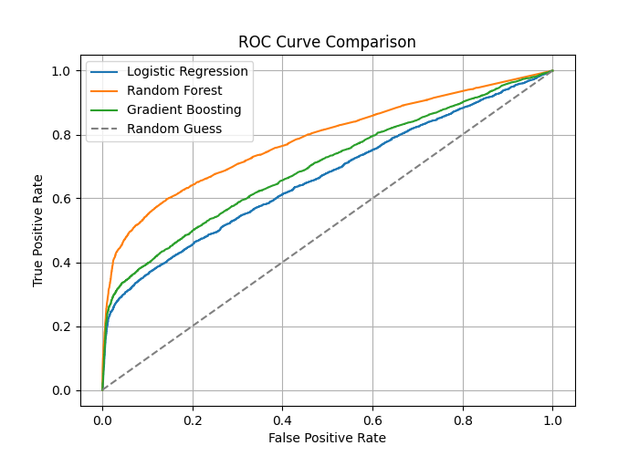

# 📦 E-Commerce Return & Satisfaction Predictor

## 📌 Project Overview
This project is an end-to-end Machine Learning web application designed to predict **Customer Satisfaction (Happy/Unhappy)** and **Churn Risk** for e-commerce orders. 

It leverages a **Gradient Boosting Classifier** to analyze logistics performance (delivery delays) and financial metrics. The model is deployed via a custom-styled **Streamlit** interface.

## Website Link
https://logistics-analyser.streamlit.app/

## 📸 Screenshots
### 1. Model Performance (ROC-AUC)

## 🏗️ Tech Stack
- **Frontend:** Streamlit (Custom CSS styling)
- **Backend:** Python, Scikit-Learn, Pandas
- **Model:** Gradient Boosting vs. Random Forest vs. Logistic Regression
- **Data Source:** Olist Brazilian E-Commerce Dataset
